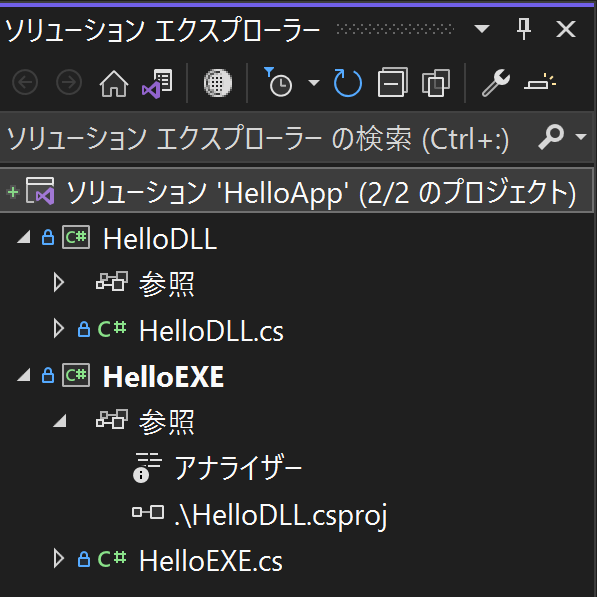

# MSBuildとVSデバッガ

## ビルド成果物とデバッグ実行

ビルド成果物の出力先はcsprojの`<OutputPath/>`に基づくため、MSBuild.exeでビルドしても、VSでビルドしても同じになります。VSの裏では単にMSBuildが利用されていると思われます。

```dos
> dir /B .\bin\Debug
HelloDLL.dll
HelloDLL.pdb
HelloEXE.exe
HelloEXE.pdb
```

VSの「デバッグの開始」（所謂、F5実行）を行うと「スタートアッププロジェクト」としてマークされたcsproj（プロジェクト）からの成果物（通常、実行ファイル）が起動され、VSデバッガがこのプロセスに自動的にアタッチします。この場合、HelloEXE.exeです。

スタートアッププロジェクトは強調表示されています。



## 任意のプロセスにアタッチする方法

以下のようにプロジェクト設定から任意のプログラムをデバッグ実行することもできます。


