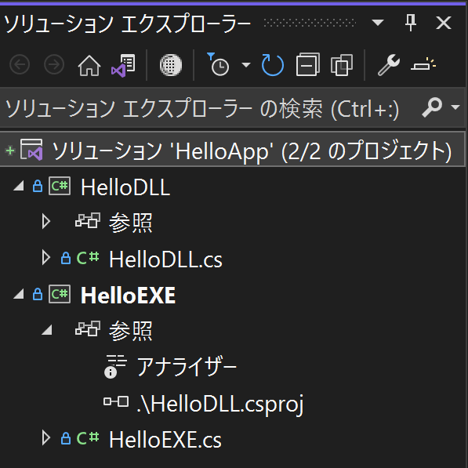

# MSBuildを使ってビルドする

## ファイル

ソースファイル

1. [HelloEXE.cs](./HelloEXE.cs)
1. [HelloDLL.cs](./HelloDLL.cs)

ビルドルールファイル

1. [HelloEXE.csproj](./HelloEXE.csproj)  
    HelloEXE.exeを生成するため。  
    ⇒ HelloDLL.csprojを参照している。

1. [HelloDLL.csproj](./HelloDLL.csproj)  
    HelloDLL.dllを生成するため。

## csprojファイル

より表現力が高く、検証可能なXMLを用いた、makefileのようなもの。

※一部省略しています（フルバージョンは上記のリンク参照）。

```xml
<?xml version="1.0" encoding="utf-8"?>
<Project ToolsVersion="15.0" xmlns="http://schemas.microsoft.com/developer/msbuild/2003">
  <PropertyGroup>
    <OutputType>Exe</OutputType>
    <AssemblyName>HelloEXE</AssemblyName>
    <TargetFrameworkVersion>v4.8</TargetFrameworkVersion>
  </PropertyGroup>
  <PropertyGroup Condition=" '$(Configuration)|$(Platform)' == 'Debug|AnyCPU' ">
    <PlatformTarget>AnyCPU</PlatformTarget>
    <DebugSymbols>true</DebugSymbols>
    <OutputPath>bin\Debug\</OutputPath>
  </PropertyGroup>
  <PropertyGroup Condition=" '$(Configuration)|$(Platform)' == 'Release|AnyCPU' ">
    <PlatformTarget>AnyCPU</PlatformTarget>
    <OutputPath>bin\Release\</OutputPath>
  </PropertyGroup>
  <ItemGroup>
    <Compile Include="HelloEXE.cs" />
  </ItemGroup>
  <ItemGroup>
    <ProjectReference Include=".\HelloDLL.csproj" />
  </ItemGroup>
</Project>
```

```xml
<?xml version="1.0" encoding="utf-8"?>
<Project ToolsVersion="15.0" xmlns="http://schemas.microsoft.com/developer/msbuild/2003">
  <PropertyGroup>
    <OutputType>Library</OutputType>
    <AssemblyName>HelloDLL</AssemblyName>
    <TargetFrameworkVersion>v4.8</TargetFrameworkVersion>
  </PropertyGroup>
  <PropertyGroup Condition=" '$(Configuration)|$(Platform)' == 'Debug|AnyCPU' ">
    <DebugSymbols>true</DebugSymbols>
    <OutputPath>bin\Debug\</OutputPath>
  </PropertyGroup>
  <PropertyGroup Condition=" '$(Configuration)|$(Platform)' == 'Release|AnyCPU' ">
    <OutputPath>bin\Release\</OutputPath>
  </PropertyGroup>
  <ItemGroup>
    <Compile Include="HelloDLL.cs" />
  </ItemGroup>
</Project>
```

## Build using MSBuild

MSBuidの実体は「MSBuild.exe」です。

```dos
> where MSBuild.exe
C:\Program Files\Microsoft Visual Studio\2022\Community\MSBuild\Current\Bin\amd64\MSBuild.exe
C:\Windows\Microsoft.NET\Framework64\v4.0.30319\MSBuild.exe
```

```dos
msbuild HelloEXE.csproj /p:Configuration=Debug;Platform=AnyCPU
```

/t:でcleanやrebuildを指定できる。

```dos
msbuild HelloEXE.csproj /p:Configuration=Debug;Platform=AnyCPU /t:rebuild
```

## ビルド成果物

csprojの`<OutputPath/>`で指定されているサブフォルダに出力されます。Configuration=Debugを指定した場合、次のようになります。

```dos
> dir /B .\bin\Debug
HelloDLL.dll
HelloDLL.pdb
HelloEXE.exe
HelloEXE.pdb
```

## Visual Studioのソリューションファイル（.sln）との関係

VSのソリューション（拡張子.sln）に上記二つのcsprojを含んだ状態はソリューションエクスプローラ内では、次のように見えます。

[HelloApp.sln(VS2022の例)](./HelloApp.sln)



このようにVSソリューションとは、ビルドルールが記述されているcsproj（VSプロジェクト）の依存関係のUI表現と言えます。

リストの２番目、HelloEXEプロジェクトの「参照」のところに「.\HelloDLL.csproj」が表示されています。

リストの１番目、HelloDLLプロジェクトはビルドの観点からは必要ないのですが、VSの機能ではソリューションに含めるようになっています。これによってソースコード「HelloDLL.cs」も編集できるようになっています。この方法を「プロジェクト参照」と呼びます。

一方、HelloDLL.dllのソースコードが存在しない、または必要がない場合、「アセンブリ参照」として参照することもできます。

## 補足

NMAKEと同様にMSBuildも言語非依存のビルドシステムです。拡張子.<言語>projは、通常、プロジェクトファイルやMSBuildファイルとも呼ばれます。

例えば、VSのC++プロジェクトを作成すると、拡張子.vcxprojが作成されます。この中味は.csprojと同じXMLSchemaを用いて記述されています。F#(.fsproj)、VB.NET(.vbproj)においても同様です。

```XML
<Project DefaultTargets="Build"
 xmlns="http://schemas.microsoft.com/developer/msbuild/2003">
```

VSの１つのソリューション（.sln）に複数言語のプロジェクトファイル（.csprojと.vcxprojなど）を含めることで、統合的にビルドすることもできます。
